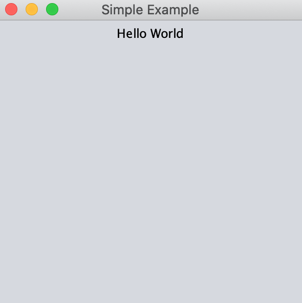
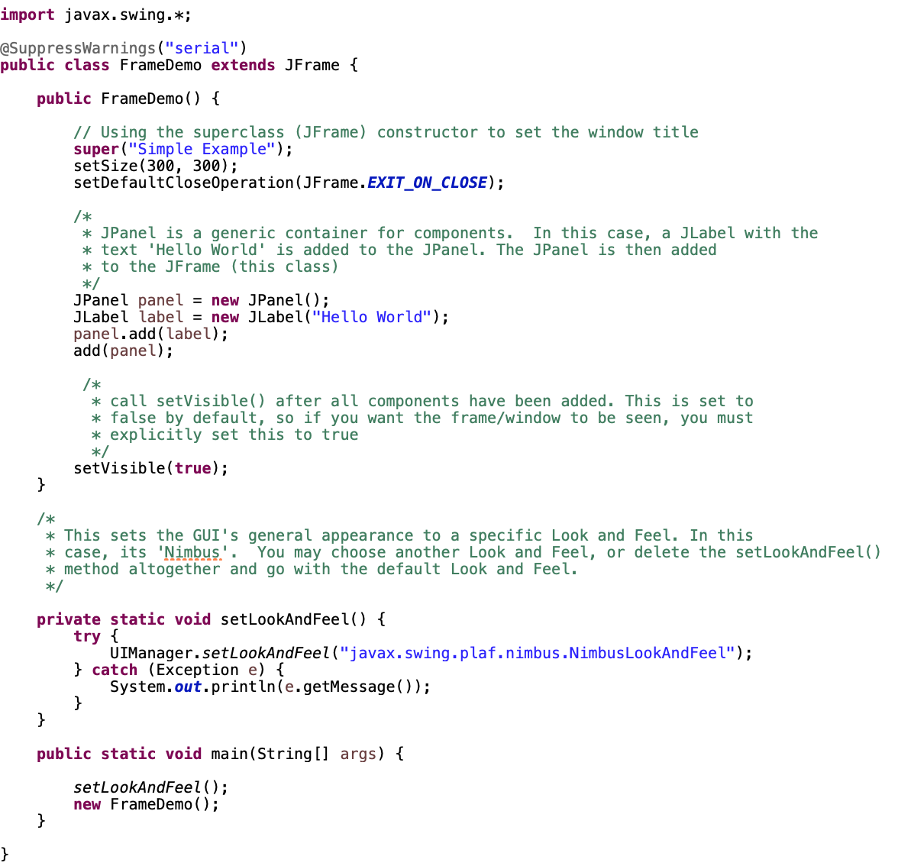

# Example Java Projects - Swing GUI

## Getting Started with Swing Components

---

Similar to SWT, Swing is a Java framework that allows you to create window-based GUI's and is built upon the AWT packages.  However, a huge benefit of Swing is that you don't have to do any additional configuration to add its components into your programs (unlike SWT or JavaFX). You can get going with a simple `import` statement at the beginning of your class file.  

Below you'll find a handful of examples and brief walk-throughs which will hopefully help you get a feel for working with Swing.  

---

## Example 1 - Hello World

To get started, we'll work with 3 of the most fundamental components of Swing: **JFrame** (windows/shells), **JPanel** (containers that hold components), and **JLabel** (text or graphics).  The end result will be a simple window that displays the text "Hello World!".  You can follow along with the source code [here](https://github.com/robbgatica/comp170-swing/blob/master/src/swing/comp170/FrameDemo.java).  

  

1.  To start out, create a new class in Eclipse. You can name it whatever you'd like (in this example I'm calling mine 'FrameDemo').  Then, import the required packages with `import javax.swing.*;` statement.   

2.  This class will inherit from the JFrame class using the `extends` keyword.  This is not strictly necessary, as you could instantiate a JFrame object inside the your class instead, and it would function exactly the same.  But for the sake of keeping it interesting, we'll just extend the functionality of JFrame directly to our class.

3.  Next, we'll create a constructor for our class, in which we will add a title to the window, set the size parameters using  the `setSize()` method, and handle the exit/quit functionality with the `setDefaultCloseOperation()` method.  All of these methods belong to the JFrame class.  Since we inhereted from JFrame, we can use them in our class as well.  

4.  Inside our class' constructor, however, we will create one instance of a `JPanel` and one instance of a `JLabel`.  The JLabel is initialized to contain the "Hello World" string. All we need to do at this point is use the `add()` method to add the label to the panel, then add the panel to the JFrame.  Finally, we need to explicitly call the `setVisible` method of JFrame and set it to `true` in order for our window to appear on screen.

At this point, your code should look like this:

  

