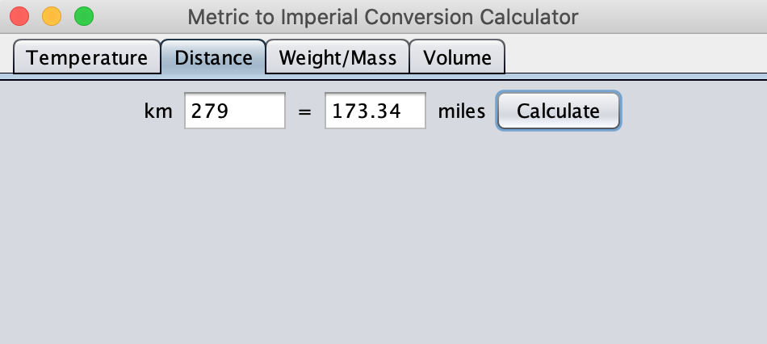

# Example Java Projects - Swing GUI

## Getting Started with Swing Components

---

Similar to SWT, Swing is a Java framework that allows you to create window-based GUI's and is built upon the AWT packages.  However, a huge benefit of Swing is that you don't have to do any additional configuration to add its components into your programs (unlike SWT or JavaFX). You can get going with a simple `import` statement at the beginning of your class file.  

Below you'll find a handful of examples and brief walk-throughs which will hopefully help you get a feel for working with Swing.  

---

## Example 1 - Hello World

To get started, we'll work with 3 of the most fundamental components of Swing: **JFrame** (windows/shells), **JPanel** (containers that hold components), and **JLabel** (text or graphics).  The end result will be a simple window that displays the text "Hello World!".  You can follow along with the source code [here](https://github.com/robbgatica/comp170-swing/blob/master/src/swing/comp170/FrameDemo.java).  

<p align="center">

  </p>

1.  To start out, create a new class in Eclipse. You can name it whatever you'd like (in this example I'm calling mine 'FrameDemo').  Then, import the required packages with `import javax.swing.*;` statement.   

2.  This class will inherit from the JFrame class using the `extends` keyword.  This is not strictly necessary, as you could instantiate a JFrame object inside the your class instead, and it would function exactly the same.  But for the sake of keeping it interesting, we'll just extend the functionality of JFrame directly to our class.

```
import javax.swing.*;

public class FrameDemo extends JFrame {

	public static void main(String[] args) {

	}

}
```

3.  Next, we'll create a constructor for our class, in which we will add a title to the window, set the size parameters (width and height in pixels) using  the `setSize()` method, and handle the exit/quit functionality with the `setDefaultCloseOperation()` method (EXIT_ON_CLOSE in this case).  All of these methods belong to the JFrame class.  Since we inhereted from JFrame, we can use them in our class as well.

```
import javax.swing.*;

public class FrameDemo extends JFrame {

	public FrameDemo() {
		
		super("Simple Example");
		setSize(300, 300);
		setDefaultCloseOperation(JFrame.EXIT_ON_CLOSE);
		
		}

	public static void main(String[] args) {

	}

}
```

4.  Inside our class' constructor, however, we will create one instance of a `JPanel` and one instance of a `JLabel`.  The JLabel is initialized to contain the "Hello World" string. All we need to do at this point is use the `add()` method to add the label to the panel, then add the panel to the JFrame.  Finally, we need to explicitly call the `setVisible` method of JFrame and set it to `true` in order for our window to appear on screen.

```
import javax.swing.*;

public class FrameDemo extends JFrame {

	public FrameDemo() {
		
		super("Simple Example");
		setSize(300, 300);
		setDefaultCloseOperation(JFrame.EXIT_ON_CLOSE);
		
		JPanel panel = new JPanel();
		JLabel label = new JLabel("Hello World");
		panel.add(label);
		add(panel);
		
		setVisible(true);
	}
```

5. At this point, if we create an instance of our FrameDemo class inside the `main()` method and run the program, our "Hello World" text will display in a new JFrame window.  Before we do that, however, I've included a (completely optional) method which will set the Look and Feel of our Swing components and GUI.  These are settings you can use to change the overall appearance, and there are a number of templates you can use if you choose to do so.  Read more about it here: [https://docs.oracle.com/javase/tutorial/uiswing/lookandfeel/plaf.html](https://docs.oracle.com/javase/tutorial/uiswing/lookandfeel/plaf.html)

```
	/*
	 * This sets the GUI's general appearance to a specific Look and Feel. In this
	 * case, its 'Nimbus'.  You may choose another Look and Feel, or delete the setLookAndFeel() 
	 * method altogether and go with the default Look and Feel.  
	 */

	private static void setLookAndFeel() {
		try {
			UIManager.setLookAndFeel("javax.swing.plaf.nimbus.NimbusLookAndFeel");
		} catch (Exception e) {
			System.out.println(e.getMessage());
		}
	}

```

6.  Whether or not you opted to add the `setLookAndFeel()` method, we'll complete this demo by instantiating our class in `main()`.

```
public static void main(String[] args) {

		setLookAndFeel();
		new FrameDemo();
	}
```

## Example 2 - Metric Conversion Calculator

Now that you've seen a very basic example of Swing, we can take a look at a slightly more interesting example.  Below is a small app that converts metric units to imperial units (km to miles, Celsius to F, etc).  You'll see how to incorporate input/output and event listeners with `JTextField, JButton, and JTabbedPane` components.  


<p align="center">

  </p>
